# :bell: Overview
This repository takes a stock of COVID-19 datasets for 26 European countries at the regional NUTS3 or NUTS2 level. 

The data is also periodically released on Zenodo:

A pre-print of the tracker is available here:
https://www.medrxiv.org/content/10.1101/2021.02.15.21251788v2.full

This repository is updated every four weeks. All raw data and scripts are available here in case more frequent updates are required. Otherwise, please feel free to request one. It takes about 30-40 mins to run all the scripts and upload them to GitHub. Please cite the Zenodo and Medrxiv DOIs if you are using the dataset for analysis. For comments, feedback, error reporting, or other queries please e-mail at asjadnaqvi@gmail.com or naqvi@iiasa.ac.at

## Challenges with data access

* Almost all countries in Europe showcase COVID-19 data in the form of choropleth maps and trend graphs. Access to data behind these visualizations varies from country to country which can be stored on various platforms ranging from official government websites, national statistical agencies, and health ministries. Some countries also just export it to third-party repositories, for example, ArcGIS Hub and GitHub. As a result, each country has to be dealt with individually. While most countries allow some form of access to regional data, others do not release this information publicly. In case of the latter, one can likely find data scraped from websites on platforms like GitHub.

* Information provided by countries is not consistent. Not all countries release data on deaths, tests performed, hospitalization rates, vaccnication rates, and by gender and age breakdowns. Thus this database, currently only focuses on cases reported, even though for most countries other information exists in the raw files as well. This will be added here soon.

## Combining data across countries

* Countries in European define regions differently, and therefore, making data homogeneous is a challenging task. For consistency, the European Commission and the Eurostat, have homogenous units called NOMENCLATURE OF TERRITORIAL UNITS FOR STATISTICS or [NUTS](https://ec.europa.eu/eurostat/web/nuts/background). NUTS0 are countries, NUTS1 are typically provinces, NUTS2 are typically districts, and NUTS3 are typically sub-districts. Most countries release information at administrative units lower than NUTS3. These are referred to as Local Administrative Units or [LAUs](https://ec.europa.eu/eurostat/web/nuts/local-administrative-units), where LAU1 (districts) and LAU2 (municipalities) were formerly NUTS4 and NUTS5 regions respectively. Currently only one level of LAU is documented by the European Commission. Several countries provide data at finer LAU levels.

* The NUTS regions are redefined every afew years (2013, 2016, 2021). Currently the 2021 NUTS regions have come into effect since 1st January 2021. But since most of the regional data on Eurostat is at the 2016 level, this tracker homogenizes data records also at the NUTS 2016 boundaries. The process of homogenization has its own set of challenges. While some countries just rename regions, others actually change, merge, and shift boundaries. Not all countries match perfectly to NUTS 2016 boundaries. For example, the data for Italy was always released at the 2021 NUTS boundaries definitions. This causes problems with a couple of small regions on the islands. Similarly, data for Finland is released at the hospital district level. These do not perfectly align with NUTS 3 boundaries. The rate of error is minimial since most of the regions affected by boundary shifts are very small. Additionally, the raw data is available which allows the data to be used as it is or aggregated to other administrative levels.

* Not all countries in Europe are in the [European Union](https://europa.eu/european-union/about-eu/countries_en), and hence are not subject to Eurostat reporting/data sharing requirements. While all countries have correspondence tables between their own region definitions and NUTS, providing NUTS level information is not mandatory for non-EU countries. This list includes, the UK (post Brexit), Norway, and the Switzerland. While some countries provide detailed regional information on COVID-19 (for example, Norway), they don't have the latest LAU-NUTS correspondence tables available. They way around this problem is to spatially overlay LAU and NUTS boundaries and extract the information based on boundary overlaps. While in theory the overlaps should be perfect, in practice, small errors might persist based on slight differences in boundaries, differences in resolution of spatial files, and simply some LAUs might cut across NUTS boundaries (UK is a good example of this problem).

# :floppy_disk: European regions and availability of COVID-19 data

| Country (NUTS 0) | Code | NUTS 1 | NUTS 2 | NUTS 3 | LAU | 
| --- | --- | --- | --- | --- | --- | 
| Austria | AT  | Gruppen von Bundesländern (3) | Bundesländer (9) | **Bezirke (35)** | Gemeniden (2096) | 
| Belgium | BE  | Gewesten / Régions (3) | Provincies / Provinces (11) | Arrondissementen / Arrondissements (44) | **Gemeenten/Communes (581)** | 
| Croatia | HR  | -  | Regija (4)    | **Županija (21)** | Gradovi i općine (556)  | 
| Czechia | CZ  | Území(1) | Regiony soudržnosti (8) | **Kraje (14)** | Obce (6258) | 
| Denmark | DK  | - | Regioner (5) | Landsdele (11) | **Kommuner (99)** | 
| Estonia | EE  | - | - | Maakondade grupid (5) | **Linn, vald (79)** | 
| Finland | FI  | Manner-Suomi, Ahvenananmaa / Fasta Finland, Åland (2) | Suuralueet/Storområden (5)  |  **Maakunnat/Landskap (19)** | Kunnat / Kommuner (311) |
| France | FR  | Zones d'études et d'aménagement du territoire (14) | Régions (27) | **Départements (101)** | Communes (34970) | 
| Germany | DE  | Länder (3) | Regierungsbezirke (38) | **Kreise (401)** | Gemeniden (11087) | 
| Greece | EL  | Geografikes Perioches (4) | **Periferies (13)** | Periferiakon Enotiton (52) | Topikes Koinotites (6134) | 
| Hungary | HU  | Statisztikai nagyrégiók (3) | Tervezési-statisztikai régiók (8) | **Megyék + Budapest (20)** | Települések (3155) | 
| Ireland | IE  | - | Regions (3) | **Regional Authority Regions (8)** | Local Election Areas (166) | 
| Italy | IT  | Gruppi di regioni (5) | Regioni (21) | **Provincie (107)** | Comuni (7926) | 
| Latvia | LV  | - | - | Statistiskie reģioni (6) | **Republikas pilsētas, novadi (119)** | 
| Netherlands | NL  | Landsdelen (4) | Provincies (12) | NUTS3 (40) | **Gemeenten (355)** | 
| Norway | NO  | - | Landsdeler (7) | Fylker (18) | **Kommuner (356)** | 
| Poland | PL  | Makroregiony (7) | **Regiony (17)** | Podregiony (73) | Gminy (2478) | 
| Portugal | PT  | Continente + Regiões Autónomas (3) | Grupos de Entidades Intermunicipais + Regiões Autónomas (7) | **Entidades Intermunicipais + Regiões Autónomas (25)** | Freguesias (3098) | 
| Romania | RO | Macroregiuni (4) | Regiuni (8) | **Judet + Bucuresti (42)** | Comuni + Municipiu + Orase (3181) |
| Slovenia | SI  | - | Kohezijske regije (2) | Statistične regije (12) | **Občine (212)** | 
| Slovak Republic | SK  | - | Oblasti (4) | **Kraje (8)** | Obce (2927) | 
| Spain | ES  | Agrupación de comunidades autónomas (7) | Comunidades y ciudades Autónomas (19) | **Provincias + islas + Ceuta, Melilla (59)** | Municipios (8131) | 
| Sweden | SE | Grupper av riksområden (3) | Riksområden (8) | **Län (21)** | Kommuner (290) |
| Switzerland | CH  | - | Grossregionen (7) | **Kantone (26)** | Gemeinden/Communes (2222) | 
| United Kingdom | UK  | Government Office Regions (12) | Counties (41) | Upper tier authorities (179) | **Lower Authority Districts (LADs) (317)** | 

Source: Extended from [Eurostat LAU page](https://ec.europa.eu/eurostat/web/nuts/national-structures). Number of regions are given in brackets. The region at which the data is available is highlighted in bold. For some countries, NUTS 0 and NUTS 1 are the same administrative regions. UK is treated as four separate countries. For the UK, daily regional data is available for England and Scotland.

The following workflow is used to compile the data:

# :file_folder: Sources of country level datasets
The date range for countries:

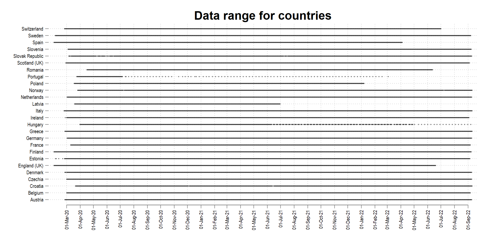

  
Data sources here 

| Country | Code  | Official institution | Data source |
| --- |  --- |  --- |  --- | 
| Austria | AT  | [AGES](https://covid19-dashboard.ages.at/)  | [Link](https://covid19-dashboard.ages.at/)  | 
| Belgium | BE  | [Sciensano](https://epistat.wiv-isp.be/covid/covid-19.html)  | [Link](https://epistat.wiv-isp.be/covid/)  | 
| Croatia | HR | [Ministry of Health](https://zdravlje.gov.hr/) | [Link](https://www.koronavirus.hr/podaci/otvoreni-strojno-citljivi-podaci/526)   |
| Czechia | CZ  | [MZCR](https://onemocneni-aktualne.mzcr.cz/covid-19)  | [Link](https://onemocneni-aktualne.mzcr.cz/api/v2/covid-19)  | 
| Denmark | DK | [SSI](https://en.ssi.dk/) | [Link](https://covid19.ssi.dk/overvagningsdata/ugentlige-opgorelser-med-overvaagningsdata)   | 
| Estonia | EE | [Health Board](https://www.terviseamet.ee/et/koroonaviirus/avaandmed) | [Link](https://www.terviseamet.ee/et/koroonaviirus/avaandmed)   | 
| Finland | FI | [THL](https://thl.fi/en/web/infectious-diseases-and-vaccinations/what-s-new/coronavirus-covid-19-latest-updates)  | [Link](https://github.com/HS-Datadesk/koronavirus-avoindata)   | 
| France | FR | [Santé publique France](https://www.santepubliquefrance.fr/)  | [Link](https://www.data.gouv.fr/fr/datasets/donnees-relatives-aux-resultats-des-tests-virologiques-covid-19/)  | 
| Germany | DE | [Robert Koch Institute (RKI)](https://www.rki.de/EN/Home/homepage.html)  | [Link](https://github.com/jgehrcke/covid-19-germany-gae)  |  
| Greece | EL | [EODY](https://eody.gov.gr/epidimiologika-statistika-dedomena/ektheseis-covid-19/) | [Link](https://github.com/Sandbird/covid19-Greece)  | 
| Hungary | HU | [Government of Hungary](https://koronavirus.gov.hu/) | [Link](https://github.com/nickgon/Hungary-COVID19-Data)   | 
| Ireland | IE | [Department of Health](https://www.gov.ie/en/organisation/department-of-health/)  | [Link](https://opendata-geohive.hub.arcgis.com/datasets/d9be85b30d7748b5b7c09450b8aede63_0)  | 
| Italy | IT | [Ministero della Salute](http://www.salute.gov.it/portale/nuovocoronavirus/homeNuovoCoronavirus.jsp?lingua=english)  | [Link](https://github.com/pcm-dpc/COVID-19)  | 
| Latvia | LV | [Government of Latvia](https://covid19.gov.lv/) | [Link](https://data.gov.lv/lv)  |
| Netherlands | NL | [RIVM](https://www.rivm.nl/en) | [Link](https://nlcovid-19-esrinl-content.hub.arcgis.com/)  | 
| Norway | NO | [NIPH](https://www.fhi.no/en/id/infectious-diseases/coronavirus/) | [Link](https://github.com/thohan88/covid19-nor-data) |  
| Poland | PL | [Government of Poland](https://www.gov.pl/web/koronawirus/) | [Link](https://github.com/covid19-eu-zh/covid19-eu-data)  |
| Portugal | PT | [DSG](https://www.dgs.pt/) | [Link](https://github.com/bruno-leal/covid19-portugal-data)  | 
| Romania  | RO  | [The National Institute of Public Health (CNSCBT)](https://www.cnscbt.ro/)  | [Link](https://datelazi.ro/)    |
| Slovak Republic | SK | [NHIC](http://www.nczisk.sk/en/Pages/default.aspx) |  [Link](https://github.com/radoondas/covid-19-slovakia/)   | 
| Slovenia | SI | [Republic of Slovenia website](https://www.gov.si/en/topics/coronavirus-disease-covid-19/)  | [Link](https://github.com/sledilnik/data)  |  
| Spain | ES | [National Center for Epidemiology](https://cnecovid.isciii.es/)  | [Link](https://cnecovid.isciii.es/covid19/)  | 
| Sweden | SE | [The Public Health Agency of Sweden](https://www.folkhalsomyndigheten.se/the-public-health-agency-of-sweden/)  | [Link](https://www.folkhalsomyndigheten.se/smittskydd-beredskap/utbrott/aktuella-utbrott/covid-19/statistik-och-analyser/bekraftade-fall-i-sverige/)  | 
| Switzerland | CH  | [Bundesamt für Gesundheit](https://www.bag.admin.ch/bag/de/home.html) | [Link](https://github.com/covid19-eu-zh/covid19-eu-data)  | 
| United Kingdom | UK  | [The UK Government](https://coronavirus.data.gov.uk/)   |    |   
| England |   | [National Health Service (NHS)](https://www.england.nhs.uk/coronavirus/)   | [Link](https://github.com/odileeds/covid-19-uk-datasets)   |    
| North Ireland |  | [Department of Health North Ireland](https://www.health-ni.gov.uk/coronavirus)  |   | 
| Scotland |   | [The Scottish Government](https://www.gov.scot/coronavirus-covid-19/)  | [Link](https://public.tableau.com/profile/phs.covid.19#!/vizhome/COVID-19DailyDashboard_15960160643010/Overview)   |   
| Wales |   |  [The Welsh Government](https://www.gov.scot/coronavirus-covid-19/)  |    |   

Note: The links are subject to change. If you find an error or a better data source, then please let me know.

# :triangular_flag_on_post: Maps

The map below shows the combined dataset of all the countries that have been processed:

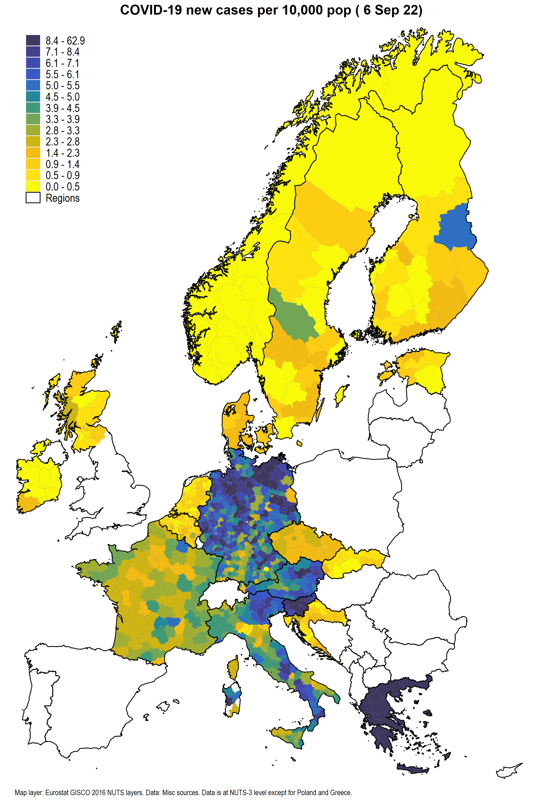

Change in cases in the past 14 days:

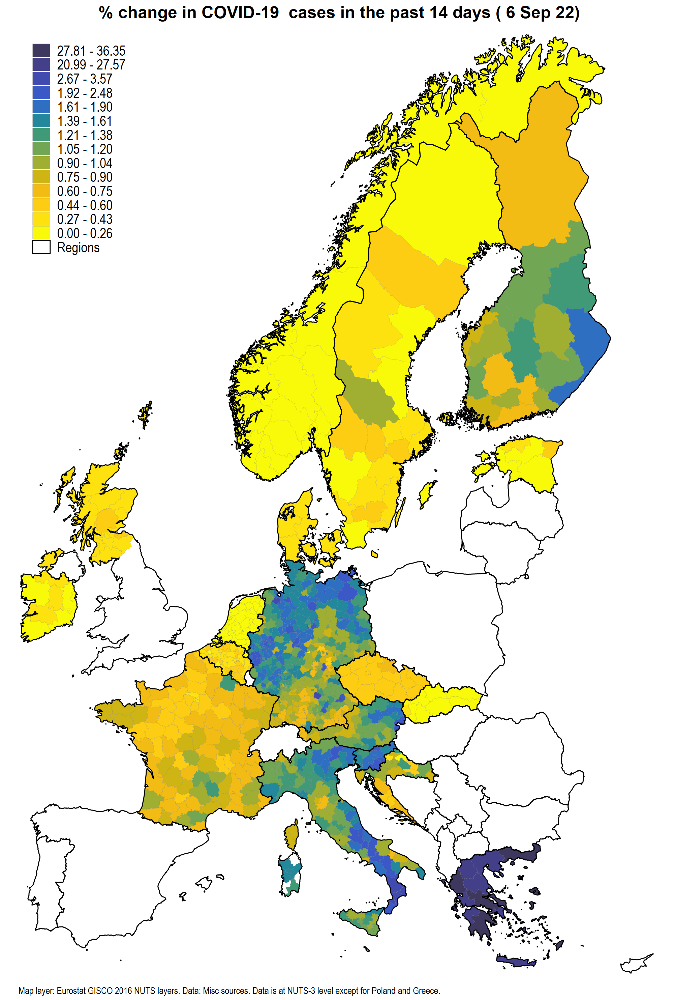

<!--- use this to mark out codes  -->

<!--- For the maps above, the last available data point is used. The video below shows the evolution of cases over time for data available till 7th December 2020:
 
Countries with data only at the NUTS-2 level have not been added to the video above. See below for individual countries maps which are updated weekly. -->

## Individual country maps:

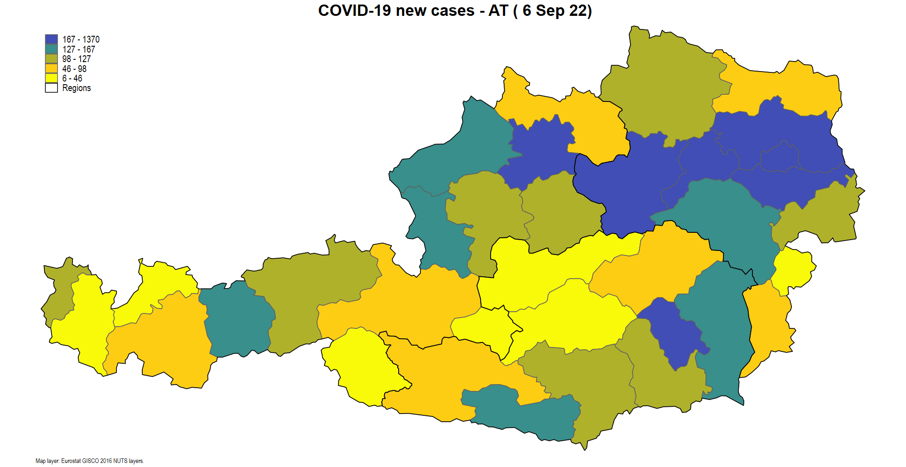

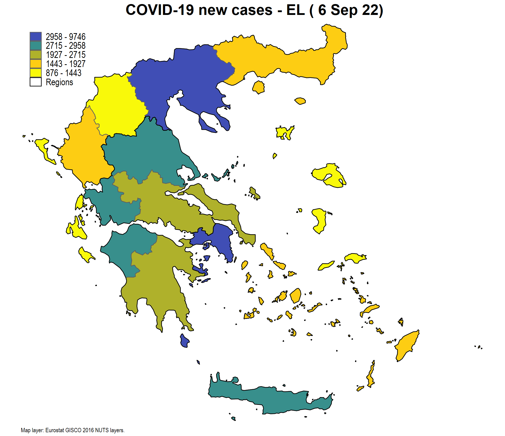
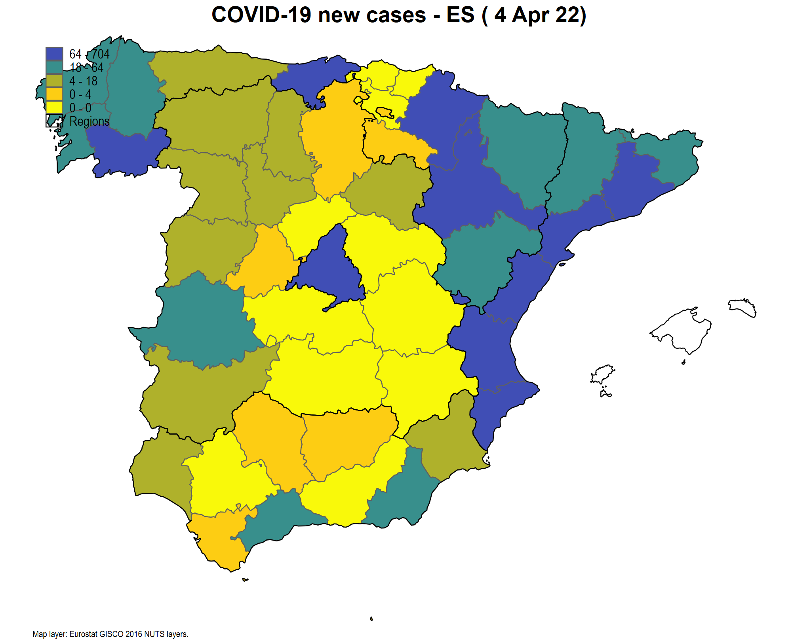

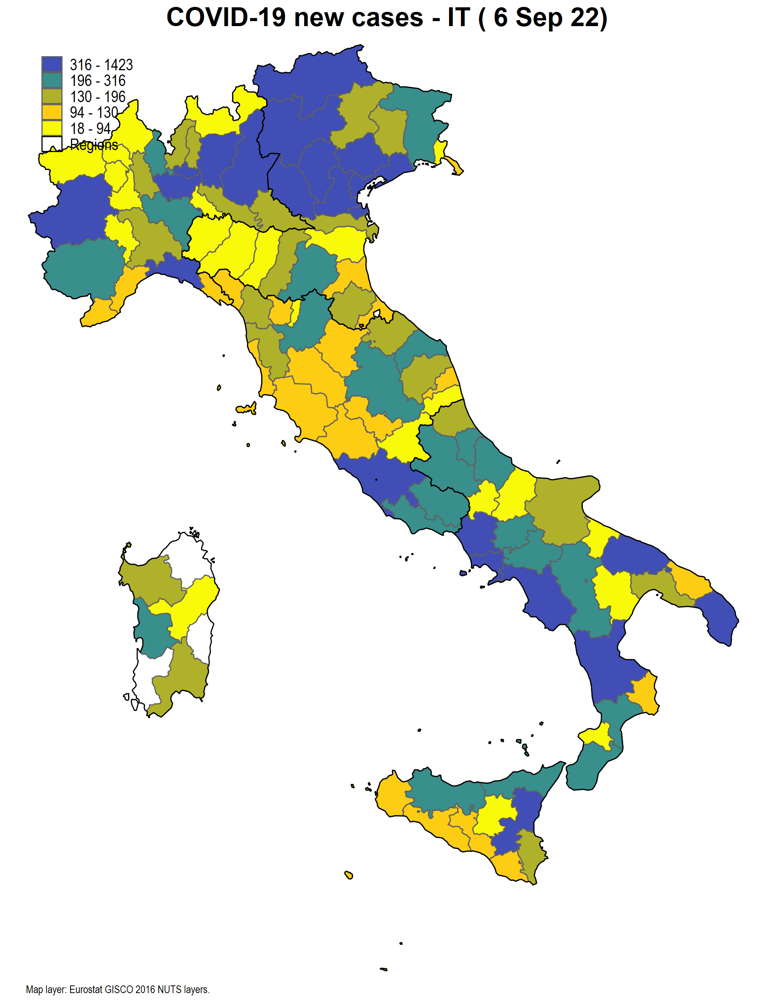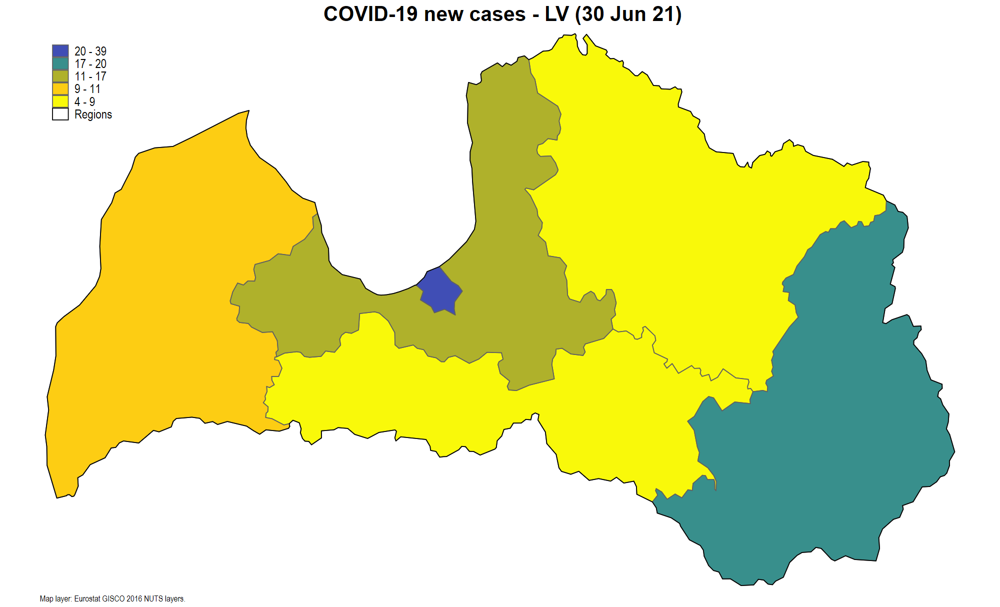
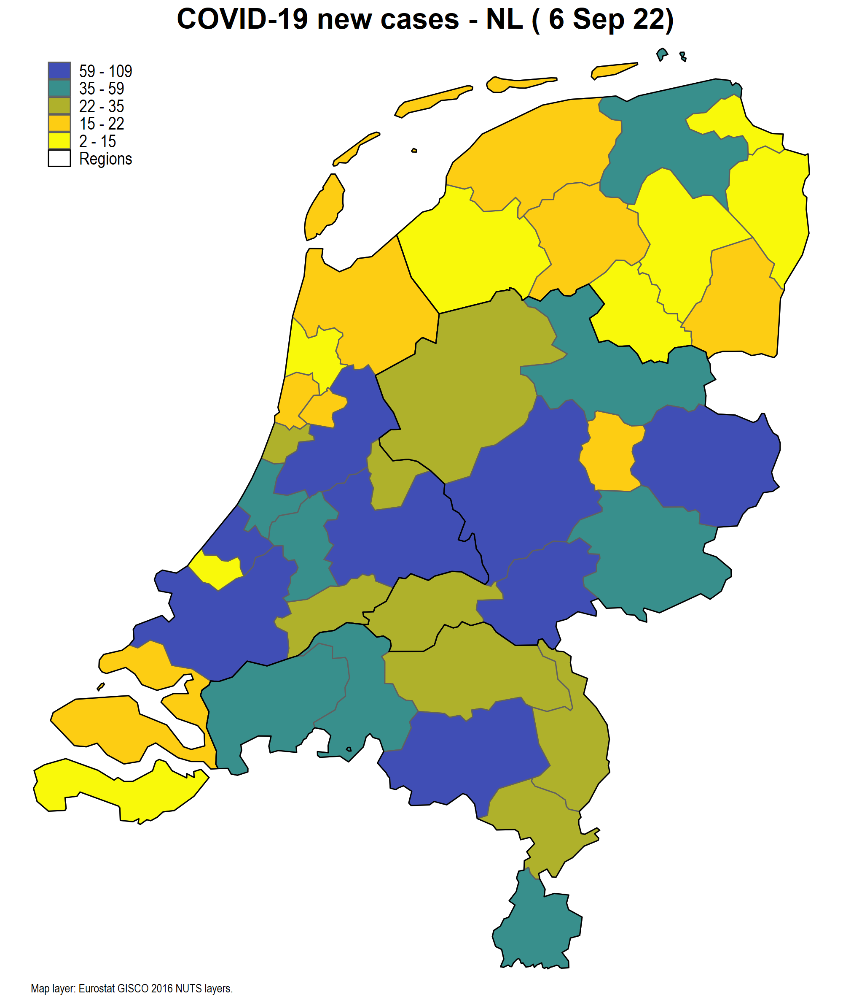

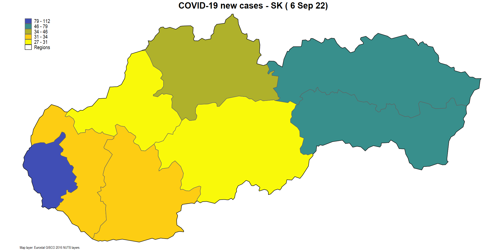

<!--- 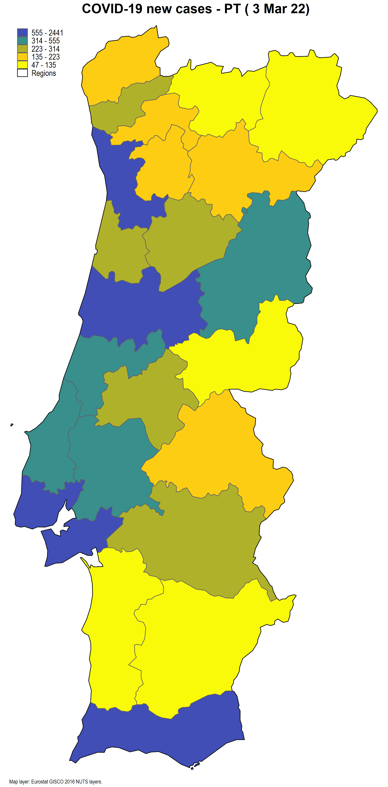 -->

# Change Logs
* 01 May 2021: All files updated for the May release. Minor errors fixed in dofiles. Population file has been updated to include 2020 regional population data. For the UK 2019 values are used since regional information no longer exists in the Eurostat database due to Brexit.
* 06 Apr 2021: All files updated for the April release. Maps switched back to Viridis color scheme.
* 22 Mar 2021: Scotland data is now from the official NHS website. The code has also been corrected. Other minor fixes to the remaining countries. I am taking out Portugal from the maps. Portugal's data is bi-weekly and it is not possible to elicit daily information. The raw data files are still in the database. Region names from the maps have been removed. A new map has been added which shows percentage change in cases in the last 14 days. Note that for Europe maps, the last available data entry of each NUTS region is used. This is to ensure that maps are as complete as possible since some data points for the latest date are missing.
* 04 Mar 2021: All files checked and updated. Minor fixes to the code. Path to access raw data for Spain fixed. Folders cleaned up further.
* 13 Feb 2021: All files checked and updated. Major fixes to the code. Raw data is now in the 04_master folder in .csv and .dta format. Daily cases fixed for several countries. Previously they were calculated as the difference between the observations and not the dates. Thus if a country had skipped several days, the daily cases would show a huge jump. These observations are now set to missing. As aa result there are more gaps now. If a country has 0 cases for a given date, that date is now dropped from the homogenized dataset. For example, Portugal which changed the reported to weekly and bi-weekly frequeny now has large gaps. The original data still contains all the dates and the values. Estonia's data fixed and it now reflects the correct values. A validation file added which aggregates country level data for each date and compares it with Our World in Data (OWID) values. This update is released as v1.3 on Zenodo.
* 25 Jan 2021: All files checked and updated. Minor fixes to code. Some file paths changed. Country level graphs now show the last data point for a region. This is just for presentation. Please see the data files for actual information.
* 05 Jan 2021: All files checked and updated. Data for Poland, Greece, Switzerland fixed. Portugal is releasing data at weekly intervals only and therefore daily cases per capita need to be imputed correctly. The scripts have been updated to Stata 16. There should not be compatibility issues with earlier versions but please report if the files don't compile. New maps added for cumulative cases and cumulative cases per capita for 2020.
* 07 Dec 2020: All files updated. Romania JSON has been scripted in Stata. Portugal status remains the same. Last regional updated was 26 Oct 2020. Portugal and Greece have been removed from the Europe map but individual files remain in the database.
* 25 Nov 2020: All files updated. Portugal has not updated the official dataset since 26 Oct, 2020. Greece data is also patchy. Maps are now organized in alphabetical order of the 2-letter country code rather than when they were added to this repository.
* 17 Nov 2020: All files added to the directory for public release. Zenodo badge created. Tables have been updated. All dofiles were checked and reworked for updates, new datasets, paths. Dofiles for country level maps will be added soon. 
* 01 Nov 2020: Scotland and Romania added. All data files and scripts were rechecked. The maps were homogenized across countries. The data range of countries was fixed. Some countries only release data periodically at regional levels.
* 25 Oct 2020: Deprecated links fixed. Date ranges removed from table and replace with a figure. If data sources for missing countries are not found, they will be replace by country level data from ECDC to complete the map.
* 17 Oct 2020: Ireland repository fixed. New Youtube video uploaded. Maps are now mix-domain NUTS3 and NUTS2 so populations are normalized accordingly.
* 04 Oct 2020: Countries with JSON datasets have been now been automated. Ireland dataset is no longer being updated on Github but the official website now provides more accurate information. This will be added soon. Still looking for UK minus England data. Potentially also looking for Lithania, Bulgaria, Romania and other counties between Croatia and Greece.
* 21 Sep 2020: Croatia and Denmark added to the maps. Ireland data is no longer updating since the Github repository is now dormant. NUTS2 population needs to be added to cases per population map.
* 16 Sep 2020: Poland and Greece NUTS2 data has been merged with the main file and added to the map. Data for Croatia and Denmark will be integrated next. Next task is to find Lithuania and Ukraine data sets.
* 07 Sep 2020: Improved documentation of the maps. All maps are now displayed above. Youtube video of changes in NUTS-3 level cases added. Map of cases and cases per pop added.
* 31 Aug 2020: Estonia, Latvia, Slovakia added to the database.
     * Estonia only provides case ranges in bands of 10 (0-10, 11-20, etc). NUTS 3 level data is approximated by taking mid-points of each range for each date/region combination and then aggregating to the NUTS 3.
* 29 Aug 2020: Switzerland and Greece added to the database. Greece is data is only available at the NUTS 2 level.
* 27 Aug 2020: 
    * Portugal: taken out for now for data checking since there are issues with the series continuity.
    * France: Historical data before 13th May added. There is a huge jump in the number of tests and reported cases for the few observations that overlap. This is because before 13th May, data was only being collected from 3 labs before proper testing protocols were introduced. There is no way of back correcting this information but maybe some form of data interpolation might help.
* 26 Aug 2020: Github repository created with documentation of regions in European countries.
