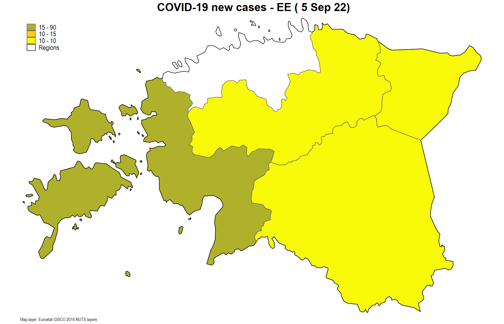
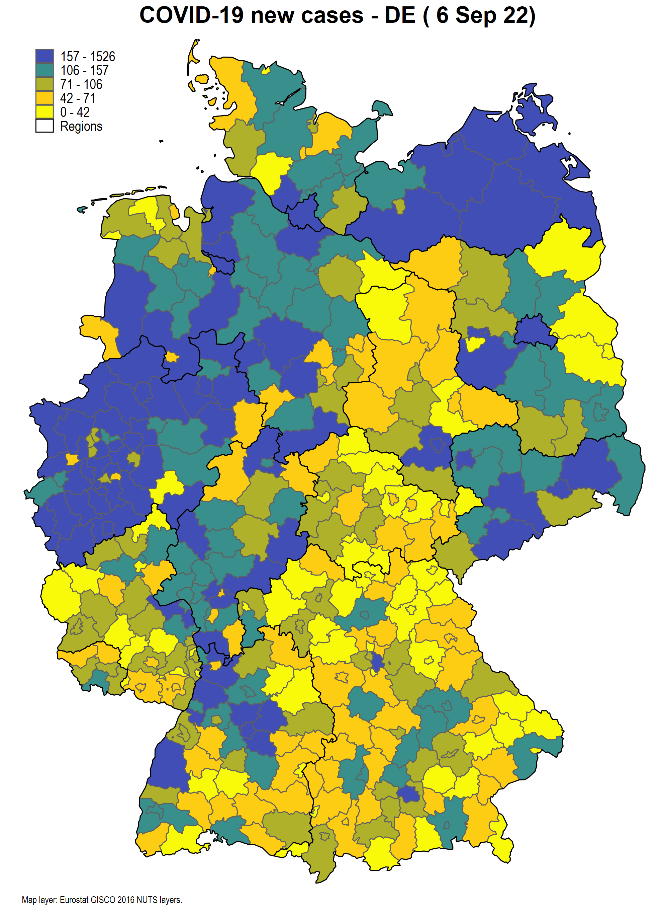
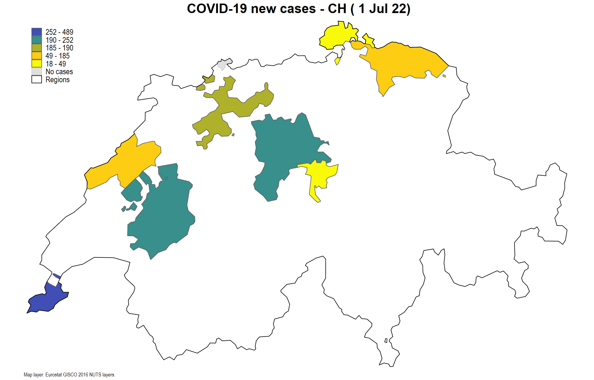
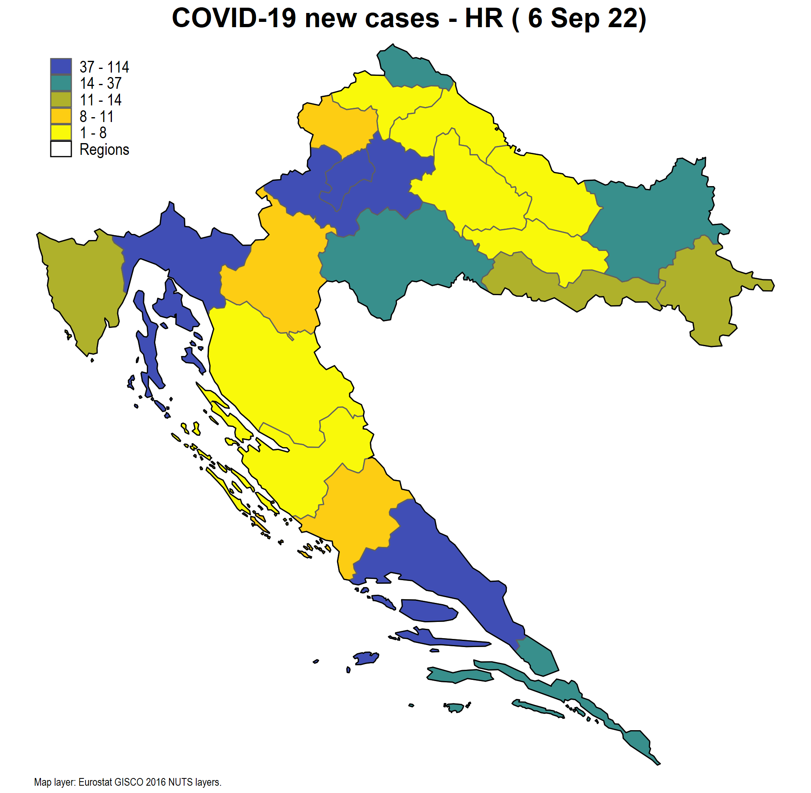
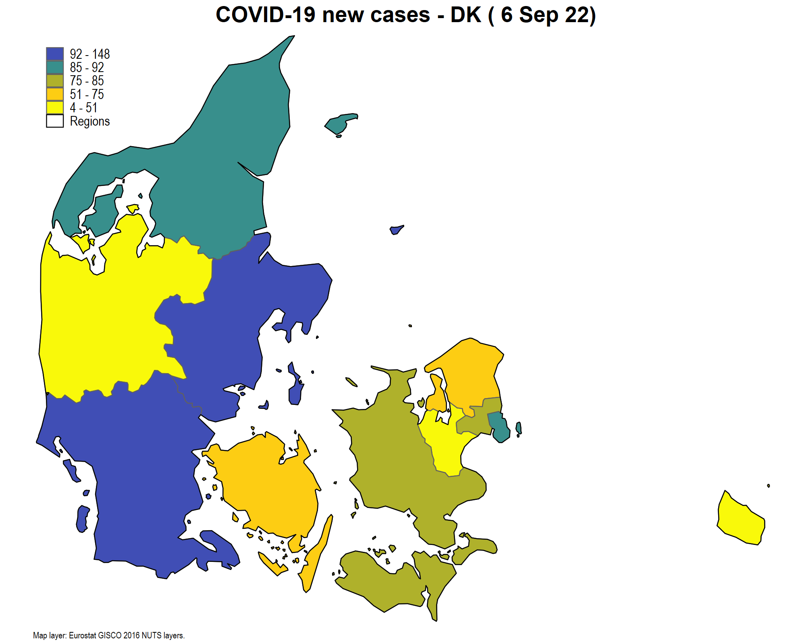

# :bell: Overview
This respository takes a stock of COVID-19 datasets for European countries at the regional (NUTS3 or NUTS2) level. This repository is updated once a week.

For queries please e-mail at asjadnaqvi@gmail.com or naqvi@iiasa.ac.at.

## Challenges with data access

* Almost all countries in Europe showcase COVID-19 data in the form of choropleth maps and trend graphs. Access to data behind these visualizations varies from country to country which can be stored on various platforms ranging from official government websites, national statistical agencies, and health ministries. Some countries also just export it to third-party repositories, for example, ArcGIS Hub and Github. As a result, each country has to be dealt with individually. While most countries allow some form of access to regional data, others do not release this information publicly. In case of the latter, one can likely find data scraped from websites on platforms like Github.

* Information provided by countries is not consistent. Not all countries release data on deaths, tests performed, hospitalization rates, gender and age breakdowns etc. Thus this database, currently only focuses on cases reported, even though for most countries other information exists as well. This will be added here soon.

## Combining data across countries

* Countries in European define regions differently, and therefore, making data homogeneous is a challenging task. For consistency, the European Commission and the Eurostat, have homogenous units called NOMENCLATURE OF TERRITORIAL UNITS FOR STATISTICS or [NUTS](https://ec.europa.eu/eurostat/web/nuts/background). NUTS0 are countries, NUTS1 are typically provinces, NUTS2 are typically districts, and NUTS3 are typically sub-districts. Most countries release information at administrative units lower than NUTS3. These are referred to as Local Administrative Units or [LAUs](https://ec.europa.eu/eurostat/web/nuts/local-administrative-units), where LAU1 (districts) and LAU2 (municipalities) were formerly NUTS4 and NUTS5 regions respectively. Currently only one level of LAU is documented by the European Commission even though countries themselves might provide data at finer levels.

* The NUTS regions are redefined every afew years (2013, 2016, 2021). Currently the 2016 definitions are used but the list of 2021 NUTS regions has been released. This has its own set of challenges. While some countries just rename regions, others actually change, merge, and shift boundaries. Data released at LAU level can be aggregated to the NUTS3 level. For this database, 2016 values are used. The switch from 2016 to 2021 definition on January 2020 might itself pose a challenge esepcially if boundaries of LAUs change. For example, the data for Italy is being released at the 2021 NUTS boundaries, which do not perfectly match 2016 boundaries.

* Not all countries in Europe are in the [European Union](https://europa.eu/european-union/about-eu/countries_en), and hence are not subject to Eurostat reporting/data sharing requirements. While all countries have correspondence tables between their own region definitions and NUTS, providing NUTS level information is not mandatory for non-EU countries. This list includes, the UK (post Brexit), Norway, Switzerland, and some countries in the East. While some countries provide detailed information on COVID-19 (for example, Norway), they don't have the latest LAU-NUTS correspondence tables available. They way around this problem is to spatially overlay LAU and NUTS boundaries and extract the information based on boundary overlaps. While in theory the overlaps should be perfect, in practice, small errors might persist based on slight differences in boundaries, differences in resolution of spatial files, and simply some LAUs might cut across NUTS boundaries (UK is a good example of this problem).

# :floppy_disk: European regions and availability of COVID-19 data

| Country (NUTS 0) | Code | NUTS 1 | NUTS 2 | NUTS 3 | LAU | 
| --- | --- | --- | --- | --- | --- | 
| Austria | AT  | Gruppen von Bundesländern (3) | Bundesländer (9) | **Bezirke (35)** | Gemeniden (2096) | 
| Belgium | BE  | Gewesten / Régions (3) | Provincies / Provinces (11) | Arrondissementen / Arrondissements (44) | **Gemeenten / Communes (581)** | 
| Czechia | CZ  | Území(1) | Regiony soudržnosti (8) | **Kraje (14)** | Obce (6258) | 
| Denmark | DK  | - | Regioner (5) | Landsdele (11) | **Kommuner (99)** | 
| Estonia | EE  | - | - | Maakondade grupid (5) | **Linn, vald (79)** | 
| Finland* | FI  | Manner-Suomi, Ahvenananmaa / Fasta Finland, Åland (2) | Suuralueet / Storområden (5)  |  **Maakunnat / Landskap (19)** | Kunnat / Kommuner (311) |
| France | FR  | Zones d'études et d'aménagement du territoire (14) | Régions (27) | **Départements (101)** | Communes (34970) | 
| Germany | DE  | Länder (3) | Regierungsbezirke (38) | **Kreise (401)** | Gemeniden (11087) | 
| Greece | EL  | Geografikes Perioches (4) | **Periferies (13)** | Periferiakon Enotiton (52) | Topikes Koinotites (6134) | 
| Hungary | HU  | Statisztikai nagyrégiók (3) | Tervezési-statisztikai régiók (8) | **Megyék + Budapest (20)** | Települések (3155) | 
| Ireland | IE  | - | Regions (3) | **Regional Authority Regions (8)** | Local Election Areas (166) | 
| Italy | IT  | Gruppi di regioni (5) | Regioni (21) | **Provincie (107)** | Comuni (7926) | 
| Latvia | LV  | - | - | Statistiskie reģioni (6) | **Republikas pilsētas, novadi (119)** | 
| Netherlands | NL  | Landsdelen (4) | Provincies (12) | NUTS3 (40) | **Gemeenten (355)** | 
| Norway* | NO  | - | Landsdeler (7) | Fylker (18) | **Kommuner (356)** | 
| Poland | PL  | Makroregiony (7) | **Regiony (17)** | Podregiony (73) | Gminy (2478) | 
| Portugal | PT  | Continente + Regiões Autónomas (3) | Grupos de Entidades Intermunicipais + Regiões Autónomas (7) | **Entidades Intermunicipais + Regiões Autónomas (25)** | Freguesias (3098) | 
| Romania | RO | Macroregiuni (4) | Regiuni (8) | **Judet + Bucuresti (42)** | Comuni + Municipiu + Orase (3181) |
| Slovenia | SI  | - | Kohezijske regije (2) | Statistične regije (12) | **Občine (212)** | 
| Slovakia | SK  | - | Oblasti (4) | **Kraje (8)** | Obce (2927) | 
| Spain | ES  | Agrupación de comunidades autónomas (7) | Comunidades y ciudades Autónomas (19) | **Provincias + islas + Ceuta, Melilla (59)** | Municipios (8131) | 
| Sweden | SE | Grupper av riksområden (3) | Riksområden (8) | **Län (21)** | Kommuner (290) |
| Switzerland* | CH  | - | Grossregionen (7) | **Kantone (26)** | Gemeinden/Communes (2222) | 
| *United Kingdom* * | UK  | Government Office Regions (12) | Counties (41) | Upper tier authorities (179) | *Lower tier authorities (400)* | 

Source: Extended from [Eurostat LAU page](https://ec.europa.eu/eurostat/web/nuts/national-structures). Number of regions are given in brackets. The region at which the data is available is highlighted in bold. For some countries, NUTS 0 and NUTS 1 are the same. Countries marked with a * are not in the EU and do not have to provide data at consistent NUTS3/LAU levels. *Italicized* countries are still being processed.

# :file_folder: Sources of country level datasets
The date range for countries:

  
Data sources here 

| Country | Code  | Official data source | Data source |
| --- |  --- |  --- |  --- | 
| Austria | AT  | [BMSGPK](https://www.sozialministerium.at/)  | [AGES](https://covid19-dashboard.ages.at/)  | 
| Belgium | BE  | [Sciensano](https://epistat.wiv-isp.be/covid/)  | [Website](https://epistat.sciensano.be/data)  | 
| Czechia | CZ  | [MZCR](https://onemocneni-aktualne.mzcr.cz/covid-19)  | [Github: google](https://github.com/GoogleCloudPlatform/covid-19-open-data#sources-of-data)  | 
| Denmark | DK | [SSI](https://en.ssi.dk/) | [Website](https://en.ssi.dk/)   | 
| Estonia | EE | [Health Board](https://www.terviseamet.ee/et/koroonaviirus/avaandmed) | [Website](https://www.terviseamet.ee/et/koroonaviirus/avaandmed)   | 
| Finland | FI |   |   | 
| France | FR | [Santé publique France](https://www.data.gouv.fr/fr/organizations/sante-publique-france/)  | [Website](https://www.data.gouv.fr/fr/datasets/donnees-relatives-aux-resultats-des-tests-virologiques-covid-19/)  | 
| Germany | DE | [Robert Koch Institute](https://www.rki.de/EN/Home/homepage.html)  | [jgehrcke](https://github.com/jgehrcke/covid-19-germany-gae)  |  
| Greece | EL | [EODY](https://eody.gov.gr/epidimiologika-statistika-dedomena/ektheseis-covid-19/) | [Github: sandbird](https://github.com/Sandbird/covid19-Greece)  | 
| Hungary | HU | [Government of Hungary](https://koronavirus.gov.hu/) | [Github: nickgon](https://github.com/nickgon/Hungary-COVID19-Data)   | 
| Ireland | IE | [Department of Health](https://www.gov.ie/en/organisation/department-of-health/)  | [Github: mathsnuig](https://github.com/mathsnuig/coronaviz)  | 
| Italy | IT |   |   | 
| Latvia | LV | [Government of Latvia](https://covid19.gov.lv/) | [Website](https://data.gov.lv/lv)  |
| Netherlands | NL | [RIVM](https://www.rivm.nl/en) | [ArcGIS datahub](https://nlcovid-19-esrinl-content.hub.arcgis.com/)  | 
| Norway | NO | [NIPH](https://www.fhi.no/en/id/infectious-diseases/coronavirus/) | [Github: thohan88](https://github.com/thohan88/covid19-nor-data) |  
| Poland | PL | [Government of Poland](https://www.gov.pl/web/koronawirus/) | [Github: google](https://github.com/GoogleCloudPlatform/covid-19-open-data#sources-of-data)  |
| Portugal | PT | [DSG](https://www.dgs.pt/) | [Github: dssg-pt](https://github.com/dssg-pt/covid19pt-data)  | 
| Romania  | RO  |            |     |
| Slovenia | SI | [Republic of Slovenia website](https://www.gov.si/en/topics/coronavirus-disease-covid-19/)  | [Github: sledilnik](https://github.com/sledilnik/data)  |  
| Slovakia | SK | [NHIC](http://www.nczisk.sk/en/Pages/default.aspx) |  [Github: radoondas](https://github.com/radoondas/covid-19-slovakia/)   | 
| Spain | ES | [National Center for Epidemiology](https://cnecovid.isciii.es/)  | [Website](https://cnecovid.isciii.es/covid19/)  | 
| Sweden | SE |   |   | 
| Switzerland | CH  | [Bundesamt für Gesundheit](https://www.bag.admin.ch/bag/de/home.html) | [Github: daenuprobst](https://github.com/daenuprobst/covid19-cases-switzerland)  | 
| United Kingdom | UK  |  |    |   | 

Notes: In the dates column *t* stands for today, and *t-x* (where *x > 0*) where *x* are the number of days. For example, *t-2*, means that today, data from two days ago is released. Some countries released data after some time gap for various reasons.

# :triangular_flag_on_post: Maps

The map below shows the combined dataset of all the countries that have been processed:

<!--- use this to mark out codes  -->

For the maps above, the last available date is used. The video below shows the evolution of cases over time for data available till 12th October 2020:

Countries with data only at the NUTS-2 level have not been added to the video above. See below for individual countries maps which are updated weekly.

## Individual country maps:

# Change Logs

* 17 Nov, 2020: All files added to the directory for public release. Zenodo badge created. Tables have been updated. All dofiles were checked and reworked for updates, new datasets, paths. Dofiles for country level maps will be added soon. 
* 01 Nov, 2020: Scotland and Romania added. All data files and scripts were rechecked. The maps were homogenized across countries. The data range of countries was fixed. Some countries only release data periodically at regional levels.
* 25 Oct, 2020: Deprecated links fixed. Date ranges removed from table and replace with a figure. If data sources for missing countries are not found, they will be replace by country level data from ECDC to complete the map.
* 17 Oct, 2020: Ireland repository fixed. New Youtube video uploaded. Maps are now mix-domain NUTS3 and NUTS2 so populations are normalized accordingly.
* 04 Oct, 2020: Countries with JSON datasets have been now been automated. Ireland dataset is no longer being updated on Github but the official website now provides more accurate information. This will be added soon. Still looking for UK minus England data. Potentially also looking for Lithania, Bulgaria, Romania and other counties between Croatia and Greece.
* 21 Sep, 2020: Croatia and Denmark added to the maps. Ireland data is no longer updating since the Github repository is now dormant. NUTS2 population needs to be added to cases per population map.
* 16 Sep, 2020: Poland and Greece NUTS2 data has been merged with the main file and added to the map. Data for Croatia and Denmark will be integrated next. Next task is to find Lithuania and Ukraine data sets.
* 07 Sep, 2020: Improved documentation of the maps. All maps are now displayed above. Youtube video of changes in NUTS-3 level cases added. Map of cases and cases per pop added.
* 31 Aug, 2020: Estonia, Latvia, Slovakia added to the database.
     * Estonia only provides case ranges in bands of 10 (0-10, 11-20, etc). NUTS 3 level data is approximated by taking mid-points of each range for each date/region combination and then aggregating to the NUTS 3.
* 29 Aug, 2020: Switzerland and Greece added to the database. Greece is data is only available at the NUTS 2 level.
* 27 Aug, 2020: 
    * Portugal: taken out for now for data checking since there are issues with the series continuity.
    * France: Historical data before 13th May added. There is a huge jump in the number of tests and reported cases for the few observations that overlap. This is because before 13th May, data was only being collected from 3 labs before proper testing protocols were introduced. There is no way of back correcting this information but maybe some form of data interpolation might help.
* 26 Aug, 2020: Github repository created with documentation of regions in European countries.
